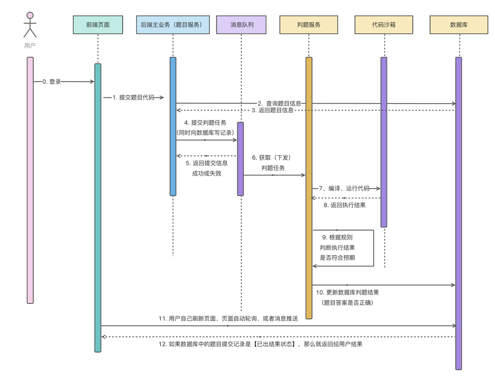
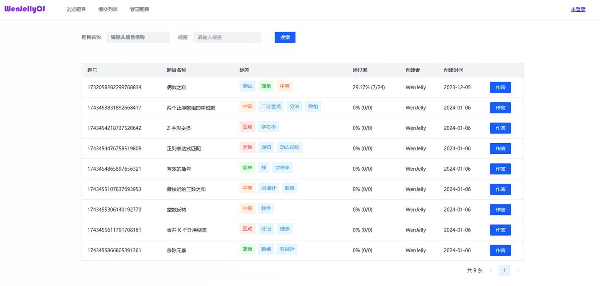
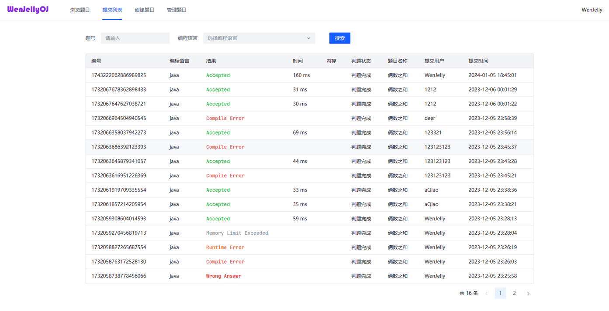
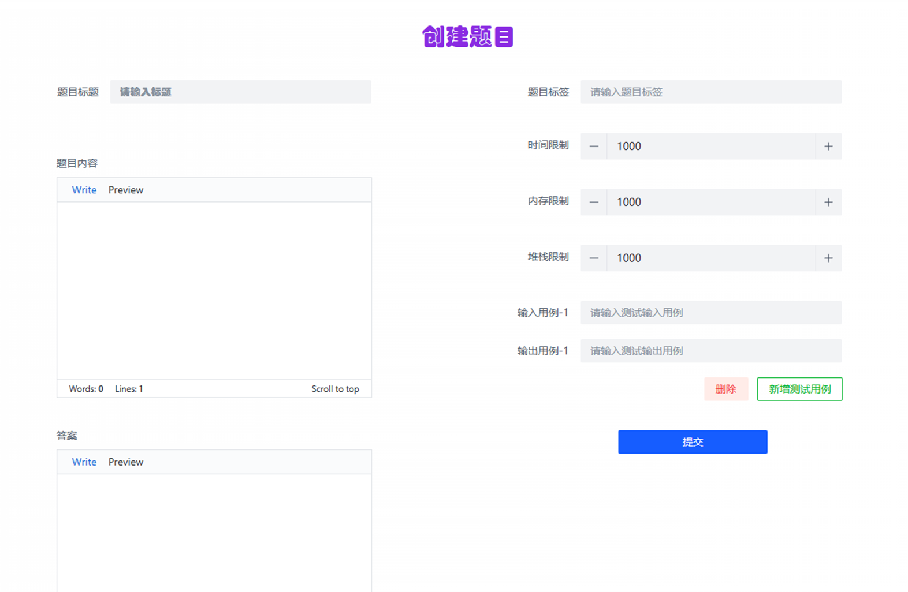
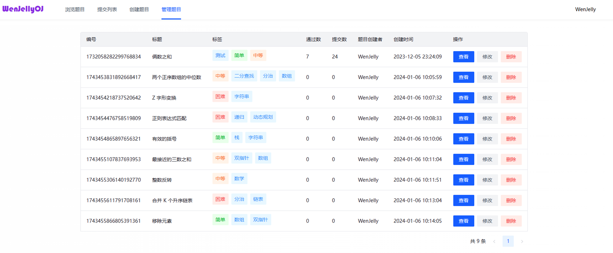
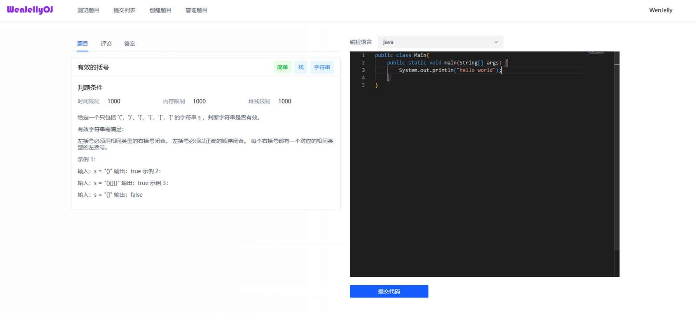
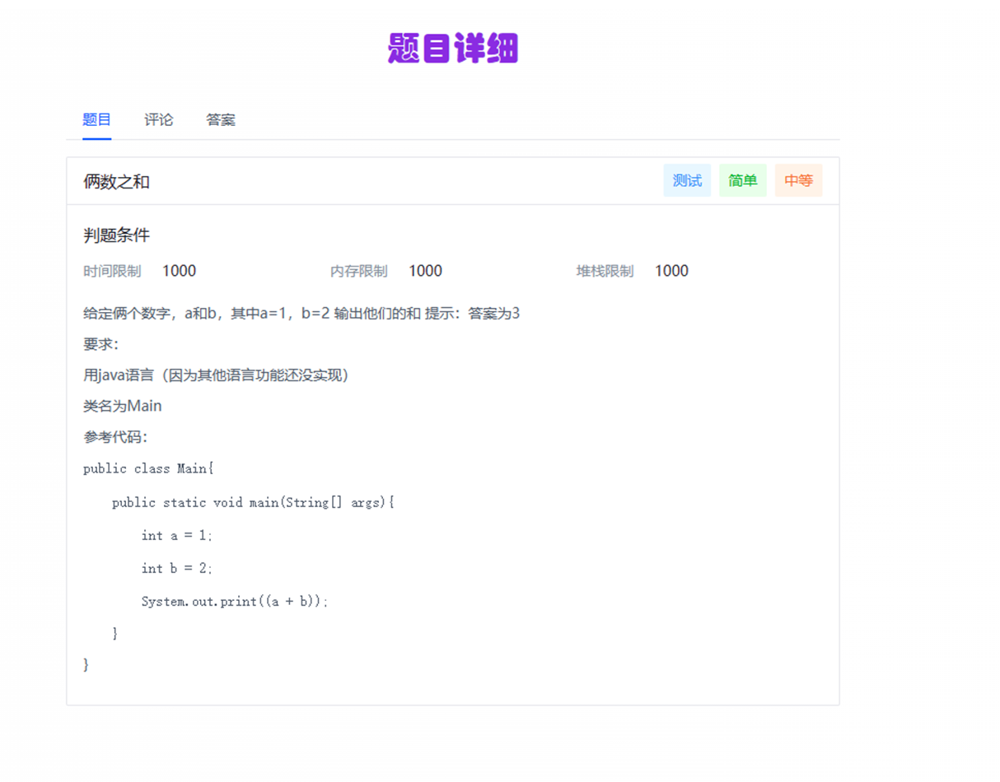

# wenjelly-backend-microservice
将 OJ系统 后端模块改造为微服务，分为以下模块

- 公共模块
- 网关模块
- 模型模块
- 服务交互模块
- 判题服务模块
- 题目服务模块
- 用户服务模块

## 项目前端
基于 Vue 3 + Arco Design 实现
>https://github.com/WenJelly/wenjellyoj-frontend

## 代码沙箱模块
>优化中，暂不开放

## 业务流程图

## 项目首页

## 提交列表结果页面

## 创建题目页面

## 管理员管理题目页面

## 编辑、提交代码页面

## 题目详情页面
